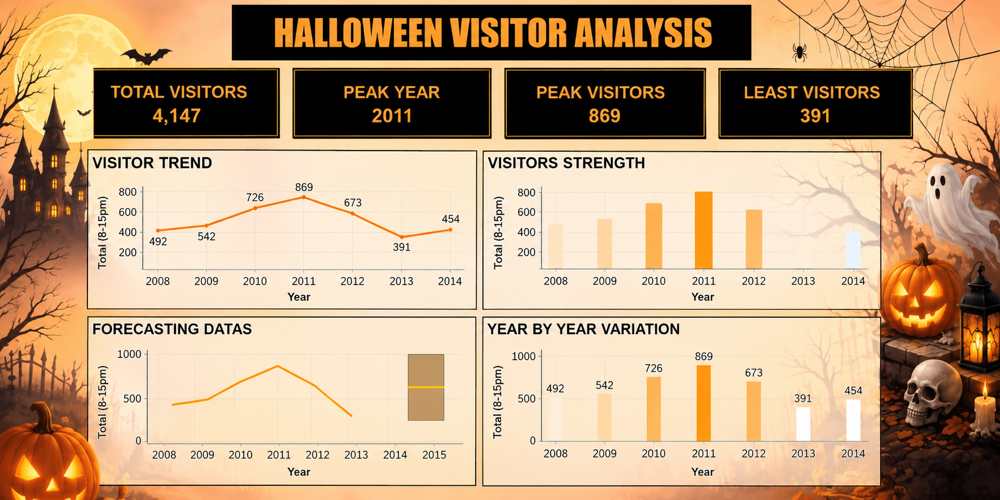

# 🎃 Halloween Visitor Analysis

This project presents a simple **Halloween Visitor Analysis Dashboard** created to understand visitor trends and yearly variations.

## 📊 Dashboard

## 🔍 Key Insights

- **Total Visitors:** 4,147
- **Peak Year:** 2011
- **Peak Visitors:** 869
- **Least Visitors:** 391
- **Highest visitor count:** 869 visitors in 2011
- **Lowest visitor count:** 391 visitors in 2013

## 📈 Analysis Included

The dashboard contains:

- Visitor Trend Analysis
- Visitors Strength by Year
- Forecasting Data
- Year-by-Year Visitor Variation

## 📅 Data Period

The analysis covers visitor data from **2008 to 2014**.

## 🛠️ Tools Used

- Data Analysis
- Data Visualization
- Dashboard Design
- Forecasting

## 🎯 Purpose

The main purpose of this project is to analyze Halloween visitor patterns, identify peak and low visitor years, and understand changes in visitor numbers over time.

## 📁 Files

- `Halloween.png` – Dashboard image
- `README.md` – Project description

---

⭐ **Halloween Visitor Analysis Dashboard**
